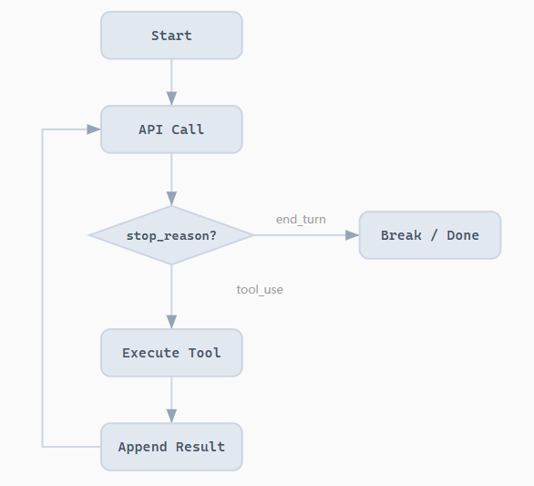

# Learn Claude Code

从 0 到 1 构建 nano Claude Code-like agent。

核心模式：所有 AI 编程 Agent 共享同一个循环：调用模型、执行工具、回传结果。生产级系统会在其上叠加策略、权限和生命周期层。

```pyhton
while True:
    response = client.messages.create(messages=messages, tools=tools)
    if response.stop_reason != "tool_use":
        break
    for tool_call in response.content:
        result = execute_tool(tool_call.name, tool_call.input)
        messages.append(result)
```

## 1. Agent Loop

Bash is All You Need.

Bash 能读写文件、运行任意程序、在进程间传递数据、管理文件系统。任何额外的工具（read_file、write_file 等）都只是 bash 已有能力的子集。增加工具并不会解锁新能力，只会增加模型需要理解的接口。模型只需学习一个工具的 schema，实现代码不超过 100 行。

> 最小的 Agent 内核是一个 While 循环 + 一个工具（Bash）。



### 问题

LLM 能推理代码, 但碰不到真实世界 -- 不能读文件、跑测试、看报错。没有循环, 每次工具调用你都得手动把结果粘回去。你自己就是那个循环。

### 解决方案

```txt
+--------+      +-------+      +---------+
|  User  | ---> |  LLM  | ---> |  Tool   |
| prompt |      |       |      | execute |
+--------+      +---+---+      +----+----+
                    ^                |
                    |   tool_result  |
                    +----------------+
                    (loop until stop_reason != "tool_use")
```

一个退出条件控制整个流程。循环持续运行, 直到模型不再调用工具。

以下是一个简化的 Agent Loop 实现示例，不到 30 行, 这就是整个智能体。后面的内容都在这个循环上叠加机制 -- 循环本身始终不变。

```python
def agent_loop(query):
    messages = [{"role": "user", "content": query}]
    while True:
        response = client.messages.create(
            model=MODEL, system=SYSTEM, messages=messages,
            tools=TOOLS, max_tokens=8000,
        )
        messages.append({"role": "assistant", "content": response.content})

        if response.stop_reason != "tool_use":
            return

        results = []
        for block in response.content:
            if block.type == "tool_use":
                output = run_bash(block.input["command"])
                results.append({
                    "type": "tool_result",
                    "tool_use_id": block.id,
                    "content": output,
                })
        messages.append({"role": "user", "content": results})
```

### 运行

```bash
uv run s01_agent_loop.py
```

测试下面这些 Prompts:

```txt
1. Create a file called hello.py that prints "Hello, World!"
2. List all Python files in this directory
3. What is the current git branch?
4. Create a directory called test_output and write 3 files in it
```

## 2. Tools

## 3. TodoWrite

## 4. Subagents

## 5. Skills

## 6. Compact

## 7. Tasks

## 8. Background Tasks

## 9. Agent Teams

## 10. Team Protocols

## 11. Autonomous Agents

## 12. Worktree + Task Isolation
