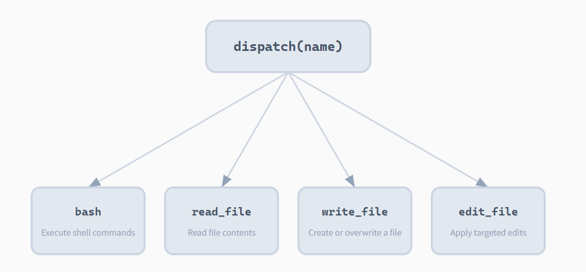
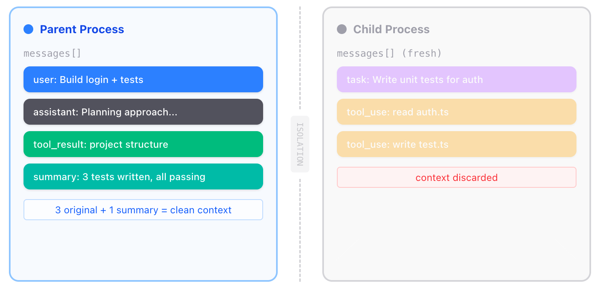

# Learn Claude Code

学习地址：[learn-claude-code](https://learn.shareai.run/)

从 0 到 1 构建 nano Claude Code-like agent。

核心模式：所有 AI 编程 Agent 共享同一个循环：调用模型、执行工具、回传结果。生产级系统会在其上叠加策略、权限和生命周期层。

```pyhton
while True:
    response = client.messages.create(messages=messages, tools=tools)
    if response.stop_reason != "tool_use":
        break
    for tool_call in response.content:
        result = execute_tool(tool_call.name, tool_call.input)
        messages.append(result)
```

## 1. Agent Loop

Bash is All You Need.

Bash 能读写文件、运行任意程序、在进程间传递数据、管理文件系统。任何额外的工具（read_file、write_file 等）都只是 bash 已有能力的子集。增加工具并不会解锁新能力，只会增加模型需要理解的接口。模型只需学习一个工具的 schema，实现代码不超过 100 行。

> 最小的 Agent 内核是一个 While 循环 + 一个工具（Bash）。


### 问题

LLM 能推理代码, 但碰不到真实世界 -- 不能读文件、跑测试、看报错。没有循环, 每次工具调用你都得手动把结果粘回去。你自己就是那个循环。

### 解决方案

```txt
+--------+      +-------+      +---------+
|  User  | ---> |  LLM  | ---> |  Tool   |
| prompt |      |       |      | execute |
+--------+      +---+---+      +----+----+
                    ^                |
                    |   tool_result  |
                    +----------------+
                    (loop until stop_reason != "tool_use")
```

一个退出条件控制整个流程。循环持续运行, 直到模型不再调用工具。

以下是一个简化的 Agent Loop 实现示例，不到 30 行, 这就是整个智能体。后面的内容都在这个循环上叠加机制 -- 循环本身始终不变。

```python
def agent_loop(query):
    messages = [{"role": "user", "content": query}]
    while True:
        response = client.messages.create(
            model=MODEL, system=SYSTEM, messages=messages,
            tools=TOOLS, max_tokens=8000,
        )
        messages.append({"role": "assistant", "content": response.content})

        if response.stop_reason != "tool_use":
            return

        results = []
        for block in response.content:
            if block.type == "tool_use":
                output = run_bash(block.input["command"])
                results.append({
                    "type": "tool_result",
                    "tool_use_id": block.id,
                    "content": output,
                })
        messages.append({"role": "user", "content": results})
```

### 运行

```bash
uv run s01_agent_loop.py
```

> 运行配置：拷贝 `.env.example` 到 `.env`, 填入你的 Base Url，API Key以及模型 ID。后续章节运行同样需要这个配置。

测试下面这些 Prompts:

```txt
1. Create a file called hello.py that prints "Hello, World!"
2. List all Python files in this directory
3. What is the current git branch?
4. Create a directory called test_output and write 3 files in it
```

## 2. Tools

One Handler Per Tool. 加一个工具, 只加一个 handler。

> The Dispatch Map: 字典将工具名称映射到处理函数。



### 问题

只有 `bash` 时, 所有操作都走 shell。`cat` 截断不可预测, `sed` 遇到特殊字符就崩, 每次 `bash` 调用都是不受约束的安全面。专用工具 (`read_file`, `write_file`) 可以在工具层面做路径沙箱。

关键洞察: 加工具不需要改循环。

### 解决方案

```txt
+--------+      +-------+      +------------------+
|  User  | ---> |  LLM  | ---> | Tool Dispatch    |
| prompt |      |       |      | {                |
+--------+      +---+---+      |   bash: run_bash |
                    ^          |   read: run_read |
                    |          |   write: run_wr  |
                    +----------+   edit: run_edit |
                    tool_result| }                |
                               +------------------+

The dispatch map is a dict: {tool_name: handler_function}.
One lookup replaces any if/elif chain.
```

### 运行

```bash
uv run s02_tool_use.py
```

测试下面这些 Prompts:

```txt
1. Read the file pyproject.toml and list all dependencies
2. Create a file called greet.py with a greet(name) function
3. Edit greet.py to add a docstring to the function
4. Read greet.py to verify the edit worked
```

## 3. TodoWrite

Plan Before You Act.

> 没有计划的代理人会随波逐流；先列出步骤，然后再执行。

### 问题

多步任务中, 模型会丢失进度 -- 重复做过的事、跳步、跑偏。对话越长越严重: 工具结果不断填满上下文, 系统提示的影响力逐渐被稀释。一个 10 步重构可能做完 1-3 步就开始即兴发挥, 因为 4-10 步已经被挤出注意力了。

### 解决方案

```txt
+--------+      +-------+      +---------+
|  User  | ---> |  LLM  | ---> | Tools   |
| prompt |      |       |      | + todo  |
+--------+      +---+---+      +----+----+
                    ^                |
                    |   tool_result  |
                    +----------------+
                          |
              +-----------+-----------+
              | TodoManager state     |
              | [ ] task A            |
              | [>] task B  <- doing  |
              | [x] task C            |
              +-----------------------+
                          |
              if rounds_since_todo >= 3:
                inject <reminder> into tool_result
```

### 运行

```bash
uv run s03_todo_write.py
```

测试下面这些 Prompts:

```txt
1. Refactor the file hello.py: add type hints, docstrings, and a main guard
2. Create a Python package with __init__.py, utils.py, and tests/test_utils.py
3. Review all Python files and fix any style issues
```

## 4. Subagents

Clean Context Per Subtask. 每个子任务一个干净的上下文。

> 子代理使用独立的消息序列，保持主会话干净。



### 问题

智能体工作越久, messages 数组越胖。每次读文件、跑命令的输出都永久留在上下文里。"这个项目用什么测试框架?" 可能要读 5 个文件, 但父智能体只需要一个词: "pytest。"

### 解决方案

```txt
Parent agent                     Subagent
+------------------+             +------------------+
| messages=[...]   |             | messages=[]      | <-- fresh
|                  |  dispatch   |                  |
| tool: task       | ----------> | while tool_use:  |
|   prompt="..."   |             |   call tools     |
|                  |  summary    |   append results |
|   result = "..." | <---------- | return last text |
+------------------+             +------------------+

Parent context stays clean. Subagent context is discarded.
```

### 运行

```bash
uv run s04_subagents.py
```

测试下面这些 Prompts:

```txt
1. Use a subtask to find what testing framework this project uses
2. Delegate: read all .py files and summarize what each one does
3. Use a task to create a new module, then verify it from here
```

## 5. Skills

Load on Demand. 按需加载技能。

> "用到什么知识, 临时加载什么知识" -- 通过 tool_result 注入, 不塞 system prompt。
>
> 在需要时通过工具结果注入知识，而不是在系统提示中预先注入。这其实是 Prompt 和 Skills 的本质区别: Prompt 是静态的, 在对话开始时就注入; Skills 是动态的, 通过工具结果在对话过程中注入。

### 问题

你希望智能体遵循特定领域的工作流: git 约定、测试模式、代码审查清单。全塞进系统提示太浪费 -- 10 个技能, 每个 2000 token, 就是 20,000 token, 大部分跟当前任务毫无关系。

### 解决方案

```txt
System prompt (Layer 1 -- always present):
+--------------------------------------+
| You are a coding agent.              |
| Skills available:                    |
|   - git: Git workflow helpers        |  ~100 tokens/skill
|   - test: Testing best practices     |
+--------------------------------------+

When model calls load_skill("git"):
+--------------------------------------+
| tool_result (Layer 2 -- on demand):  |
| <skill name="git">                   |
|   Full git workflow instructions...  |  ~2000 tokens
|   Step 1: ...                        |
| </skill>                             |
+--------------------------------------+
```

第一层: 系统提示中放技能名称 (低成本)。

第二层: tool_result 中按需放完整内容。

### SKILL 工作原理

每个技能是一个目录, 包含 `SKILL.md` 文件和 YAML frontmatter。

格式如下：

```markdown
---
name: git
description: Git workflow helpers
---

# Git Workflow Instructions
1. To commit changes, use: `git commit -m "message"`
2. To push changes, use: `git push origin branch_name`
...
```

`SkillLoader` 递归扫描 `SKILL.md` 文件, 用目录名作为技能标识。

第一层写入系统提示。第二层不过是 dispatch map 中的又一个工具(`load_skill`)。

```python
SYSTEM = f"""You are a coding agent at {WORKDIR}.
Skills available:
{SKILL_LOADER.get_descriptions()}"""

TOOL_HANDLERS = {
    # ...base tools...
    "load_skill": lambda **kw: SKILL_LOADER.get_content(kw["name"]),
}
```

### 运行

```bash
uv run s05_skill_loading.py
```

测试下面这些 Prompts:

```txt
1. What skills are available?
2. Load the agent-builder skill and follow its instructions
3. I need to do a code review -- load the relevant skill first
4. Build an MCP server using the mcp-builder skill
```

## 6. Compact

## 7. Tasks

## 8. Background Tasks

## 9. Agent Teams

## 10. Team Protocols

## 11. Autonomous Agents

## 12. Worktree + Task Isolation
